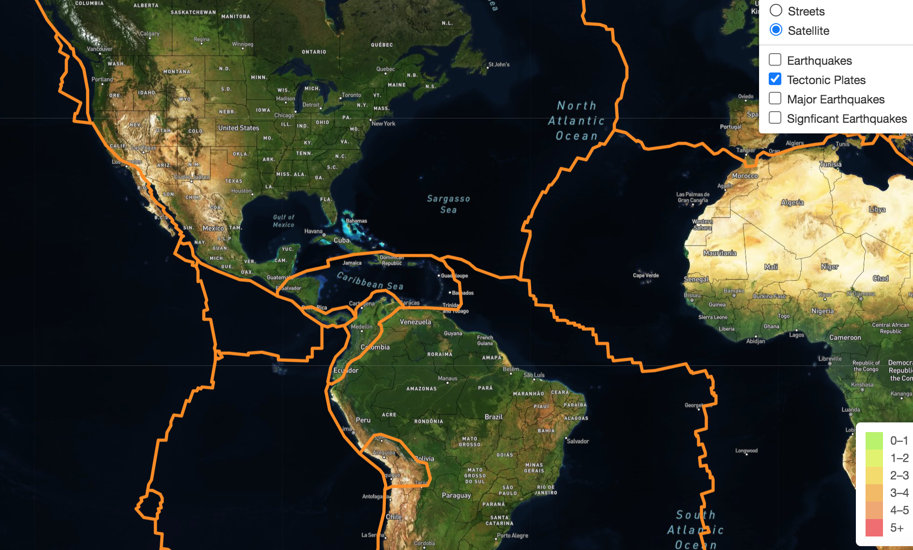
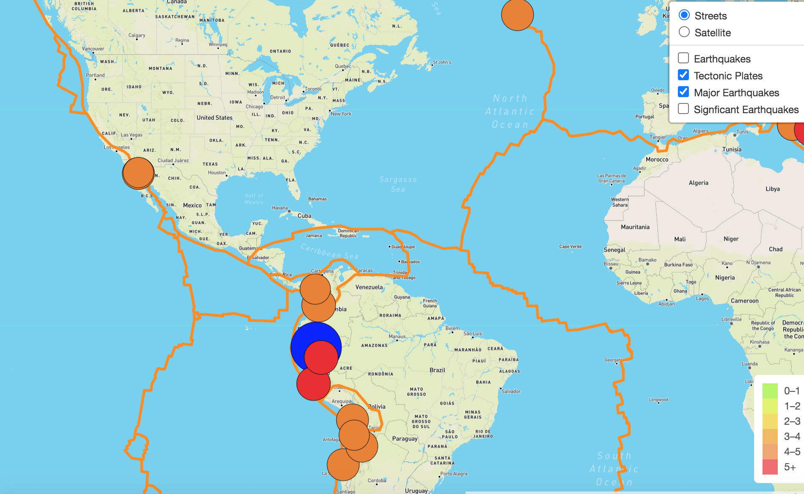
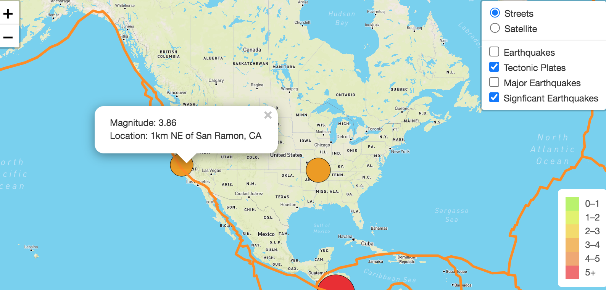

# Mapping Earthquakes with JS & APIs
## Project Overview
The purpose of this project is to visualize the maginutudes of earthquakes all over the world within the last seven days. With use of JavaScript, Leaflet.js, and geoJSON data, I have created such map with multiple overlays. We pulled the GeoJSON data from the USGS website, which contains the coordinates and maginautes of the earthquakes. The script we wrote loads in this data and adds it into the map, along with a few steps in between. The maps are ploted with Leaflet library and the use of an API request. The maps are interactive and contain layers to show the earthquake data in relation to the tectonic plates' location, display all the earthquakes within the past week with a magnitude greater than 4.5, and show significant earthquakes within the past month. 
In this challange, we create maps with multiple overlays and customize them to appropriately visualize the date. Some examples of this include: 

- The option to view the map in a different style (street, satellite, dark)
- Marker size, shape, and color
- Information in popup boxes

## Results 
### Deliverable 1: Add Tectonic Plate Data

### Deliverable 2: Add Major Earthquake Data

### Deliverable 3: Add an Additional Map

